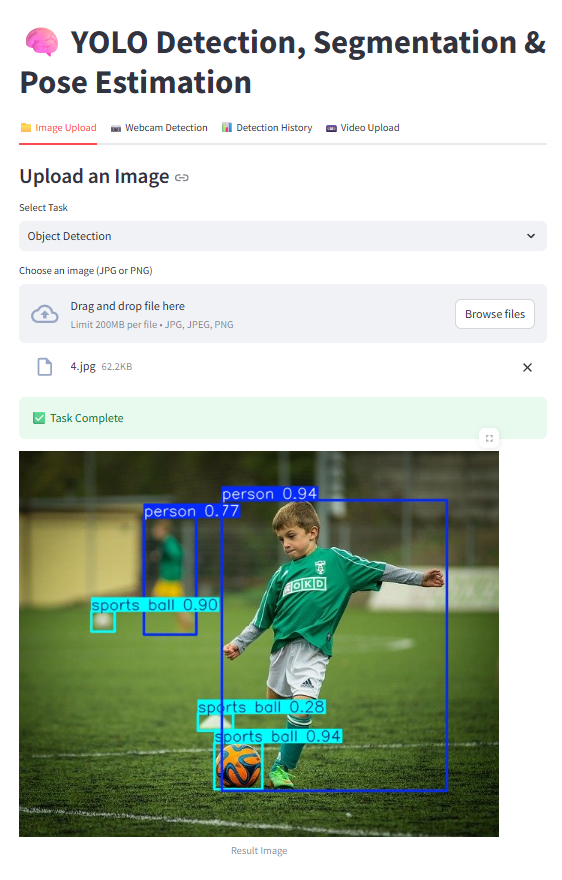

# YOLO Detection, Segmentation & Pose Estimation Platform
## 🧩 Overview
A modular platform built with **FastAPI** + **Streamlit** to perform:
- Object Detection (YOLOv8)
- Instance Segmentation (YOLOv8-seg)
- Pose Estimation (YOLOv8-pose)
- Video Frame Inference (Detection / Segmentation / Pose)

---



## 🛠️ Setup

```bash
conda create --name vision_models python=3.8
conda activate vision_models

pip install -r requirements.txt
```

---

## ▶️ Run Services


### 🔹 Start Backend
```bash
uvicorn backend.main:app --reload
```

### 🔹 Start Frontend
```bash
streamlit run frontend/app.py
```

---


## 📥 Pretrained Models
Place these files in a `models/` folder or project root:

- [`yolov8n.pt`](https://github.com/ultralytics/assets/releases/download/v0.0.0/yolov8n.pt)
- [`yolov8n-seg.pt`](https://github.com/ultralytics/assets/releases/download/v0.0.0/yolov8n-seg.pt)
- [`yolov8n-pose.pt`](https://github.com/ultralytics/assets/releases/download/v0.0.0/yolov8n-pose.pt)


---


## 📜 License
MIT License. Ultralytics YOLO models used under their respective licenses.
